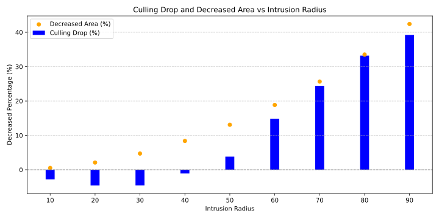

# Simulation Project

*Exploring dynamic simulations and insightful results*

## Simulation Animation

Witness the dynamic interactions and behaviors modeled by our simulation framework. This animation represents one of the many scenarios our project can simulate.

## Result Visualization

Our results are presented with detailed graphical visualizations to provide clarity and deeper insights. Below is an example representation of our analysis:

---

&copy; 2024 Simulation Project Team | Designed for innovation and impact
